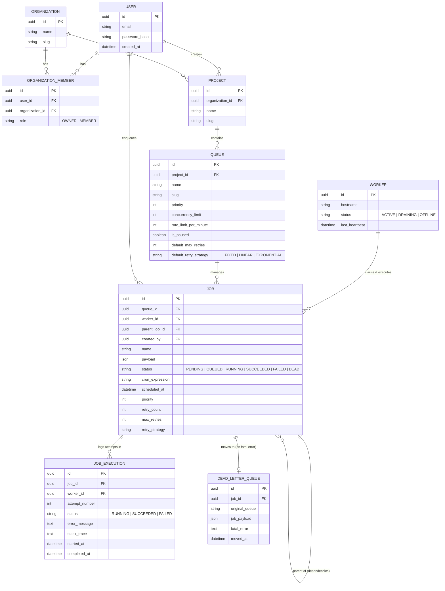

# Entity Relationship (ER) Diagram

This document contains the Entity Relationship diagram for the Nebula Scheduler.
If you are viewing this on GitHub, the Mermaid diagram will render automatically.

